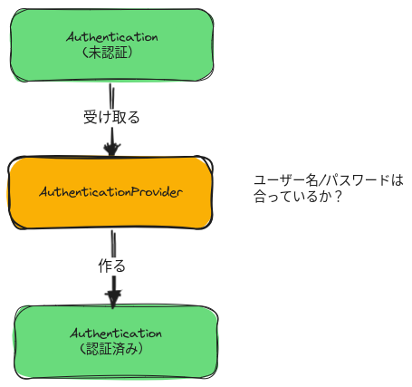
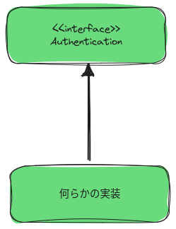
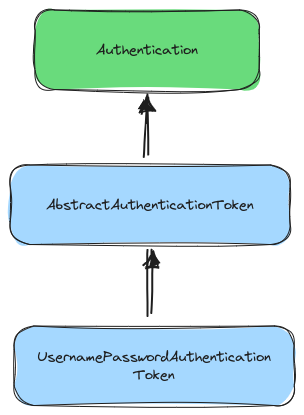
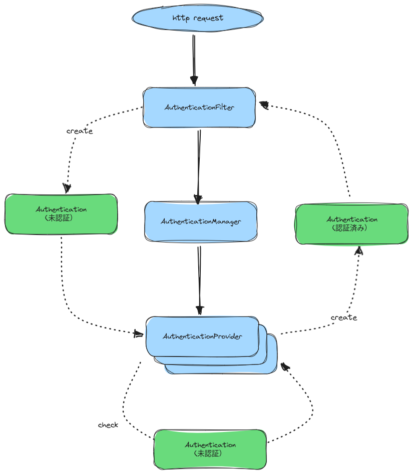

# SpringSecurityにおけるAuthenticationとは

ここ何日かSpringSecurityで遊んでいるのですが、Authenticationについて腑に落ちたのでメモを残します。

## Authentication is 何

Authenticationとは名前の通り認証を表現するもので、その実態はJavaのインターフェイスです。認証処理の過程でその実装クラスに応じ適切な認証処理を選択できる仕組みとなっています。

一般的なユーザー名/パスワードのログインケースで考えてみましょう。まず認証処理を開始するために未認証であることを示すAuthenticationを作成します。ユーザが送ってきたユーザ名/パスワードの検証に成功すれば、認証済みであることを示すAuthenticationを新たに作成します。未認証のAuthenticationを受取、認証済みのAuthenticationを返す仕事を担うのがAuthenticationProviderです。



※ 未認証のユーザを表す[AnonimousAuthenticationToken](https://spring.pleiades.io/spring-security/reference/servlet/authentication/anonymous.html)というものもあるのですが、あまり意識する必要がないのと、話が不用意に複雑になると思うのでここでは掘り下げません。

Authenticationはclassではなくinterfaceとして定義されているため何かしら実装が必要になるわけですが、これはSpringSecurityが備えているクラスを使うこともできますし独自に定義することもできます。



Authenticationの定義は次のとおりです。

``` java
public interface Authentication extends Principal, Serializable {
	Collection<? extends GrantedAuthority> getAuthorities();
	Object getCredentials();
	Object getDetails();
	Object getPrincipal();
	boolean isAuthenticated();
	void setAuthenticated(boolean isAuthenticated) throws IllegalArgumentException;
}
```

https://github.com/spring-projects/spring-security/blob/040b87911946b40d290141b93bdee20a54391c34/core/src/main/java/org/springframework/security/core/Authentication.java

認証済みかどうかは `isAuthenticated()` メソッドで確認する決まりです。

## Authentication の具体的な実装を読んでみよう

インターフェイスだけを眺めていてもあまりイメージがわかないので、その実装クラスにフォーカスを移してみましょう。

例えば、デフォルトのフォームログインにおいて、ユーザ名/パスワード認証をする時に使われるAuthenticationの実装は `UsernamePasswordAuthenticationToken` です。このクラスは `AbstractAuthenticationToken` クラスを継承することで間接的に `Authentication` を実装しています。



https://github.com/spring-projects/spring-security/blob/040b87911946b40d290141b93bdee20a54391c34/core/src/main/java/org/springframework/security/authentication/UsernamePasswordAuthenticationToken.java

このクラスをよく見てみると未認証のインスタンスを生成するファクトリメソッド、認証済みのインスタンスを生成するファクトリメソッドがそれぞれ定義されていることが分かります。

``` java
// 未認証を表すインスタンスを生成する
public static UsernamePasswordAuthenticationToken unauthenticated(Object principal, Object credentials) {
    return new UsernamePasswordAuthenticationToken(principal, credentials);
}
```

``` java
// 認証済みを表すインスタンスを生成する
public static UsernamePasswordAuthenticationToken authenticated(Object principal, Object credentials,
        Collection<? extends GrantedAuthority> authorities) {
    return new UsernamePasswordAuthenticationToken(principal, credentials, authorities);
}
```

それぞれのファクトリメソッドで呼び出すコンストラクタは異なっており、親の `AbstractAuthenticationToken#setAuthenticated` を適切な値で呼び出します。

``` java
public void setAuthenticated(boolean authenticated) {
    this.authenticated = authenticated;
}
```

https://github.com/spring-projects/spring-security/blob/15d9b7824c4def1d8962709534ea105335e34077/core/src/main/java/org/springframework/security/authentication/AbstractAuthenticationToken.java#L88C1-L91

想像に難しくないと思いますが未認証の場合は `false` で認証済みの場合は `true` になります。ここでセットされた値は `Authentication#isAuthenticated` の戻り値として使用されます。

## UsernamePasswordAuthenticationToken インスタンス化するのは誰なのか？

インスタンス化するタイミング場所とタイミングはそれぞれ異なっています。

未認証のインスタンスを生成するタイミングはユーザ名/パスワードが送信されてきたタイミングであり、 `UsernamePasswordAuthenticationFilter` クラスが生成を行います。

実際のコードを見てみましょう。

``` java
@Override
public Authentication attemptAuthentication(HttpServletRequest request, HttpServletResponse response)
        throws AuthenticationException {
    if (this.postOnly && !request.getMethod().equals("POST")) {
        throw new AuthenticationServiceException("Authentication method not supported: " + request.getMethod());
    }
    String username = obtainUsername(request);
    username = (username != null) ? username.trim() : "";
    String password = obtainPassword(request);
    password = (password != null) ? password : "";
    // ↓ここで未認証のインスタンスを生成している
    UsernamePasswordAuthenticationToken authRequest = UsernamePasswordAuthenticationToken.unauthenticated(username,
            password);
    setDetails(request, authRequest);
    return this.getAuthenticationManager().authenticate(authRequest);
}
```

https://github.com/spring-projects/spring-security/blob/15d9b7824c4def1d8962709534ea105335e34077/web/src/main/java/org/springframework/security/web/authentication/UsernamePasswordAuthenticationFilter.java#L71-L86

このフィルターは生成したインスタンスをもとに認証処理を起動します。

認証済みのインスタンスを生成するのは `AbstractUserDetailsAuthenticationProvider` になります。このクラスは冒頭で説明した `AuthenticationProvider` を実装しています。

このProviderクラスは認証を実施し成功した場合に認証済みのインスタンスを生成します。

``` java
protected Authentication createSuccessAuthentication(Object principal, Authentication authentication,
        UserDetails user) {
    // ↓ここで認証済みのインスタンスを生成している
    UsernamePasswordAuthenticationToken result = UsernamePasswordAuthenticationToken.authenticated(principal,
            authentication.getCredentials(), this.authoritiesMapper.mapAuthorities(user.getAuthorities()));
    result.setDetails(authentication.getDetails());
    this.logger.debug("Authenticated user");
    return result;
}
```

https://github.com/spring-projects/spring-security/blob/15d9b7824c4def1d8962709534ea105335e34077/core/src/main/java/org/springframework/security/authentication/dao/AbstractUserDetailsAuthenticationProvider.java#L190-L201

## 全体の流れを整理する

認証処理の開始から終了までのAuthenticationの動きを整理しておきましょう。

図に起こすとこのようになります。



必ずこの処理通りにしなければいけないわけではありませんが、基本的には上記の図の処理フローとなると思います。
